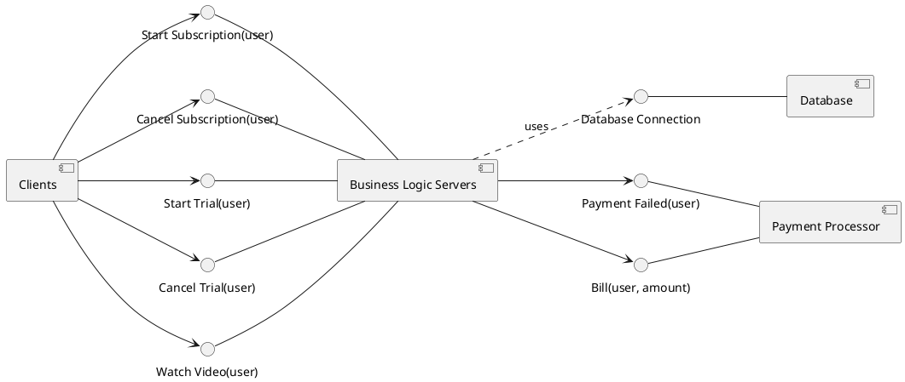
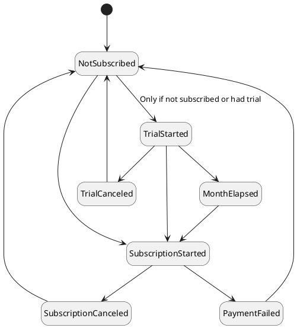



## Introduction
### Your bio

You're the kind of person who uses acronyms like [OLTP](https://en.wikipedia.org/wiki/Online_transaction_processing), [OLAP](https://en.wikipedia.org/wiki/Online_analytical_processing) and [OAuth](https://oauth.net/) in a sentence and knows what they mean. Whenever your company gets together for a game of Whiteboard, you win hands down. 
It's been a little while since you've coded anything, but it's like riding a bike: terrifying and dangerous. Modeling languages are fair game though! 

### Your assignment

1. Clarify the customers requirements into a requirements document
2. Distill the requirements document down into a formal specification
3. Come up with an architecture based on the requirements

By the end of this, coding the solution should be a piece of cake.

> Note: The client has only contracted us to build the backend software and expose APIs. A different firm is handling the frontend.

## Creating the requirements document

Through conversations with the customers, you have distilled their requirements into a standard format.

### Functional requirements



### Non-Functional requirements



## Requirements summary
You feel confident that you've gathered all the necessary requirements to ensure successful delivery on the contract. There are 44 requirements including sub-clauses, which is not that many, but you're worried some might be forgotten due to the tight deliverable schedule. Formal modeling seems like a good way to ensure that doesn't happen, but first you need to come up with an architecture.

## Architecture

Based on the requirements, it's safe to chose a simple architecture, with an autoscaling group of **Business Logic Servers** that access a **Database** hosted in a replica set. There is also an external **Payment Processor** that can accept bills, and occasionally provide _Payment Failed callbacks_.

Now that you've come up with the architecture, you're satisfied that it will work within the requirements and your team won't have any trouble with it.

## Creating the Formal Specification Model

Looking over the requirements, it's clear that only the Functional Requirements can be modeled. That might not always be true, but in this case they only influence implementation details and not the Business Logic itself. You don't want to provide the implementation details; after all, that's not your job. You need to write the spec in an implementation-agnostic way.

### The state machine

You create a state machine of the user workflow. The state machine here will not necessarily translate directly to a model, but it's still useful to have.

### Data Model

The data model is shared between the specification and all the implementations. It lays out all the event types used for observability.


### Specification

You trace every requirement above to the specification. This is to ensure that every requirement is either represented formally or deliberately excluded.



### Stubs
You write initial stubs for all the API calls such that you can add appropriate observability. You also provide the basic architecture of the spec to keep the assignment bounded.



_Note: Generally you expect the first formal spec you write won't be perfect. If failures are being reported when they shouldn't, the spec may need to be revised. There's a collaborative process as the spec gets refined and becomes accurate. We've removed that from this narrative for simplicity. Assume there was a back-and-forth and you're seeing the 3rd revision of the spec above._

## Summary

Satisfied that you have specified and architected the system about as well as you can, you pass it off to a junior developer to implement. You work for a contracting firm. How else are you supposed to pay the bills?

  

| Next: [Junior Developer tries their best](../junior-dev) |