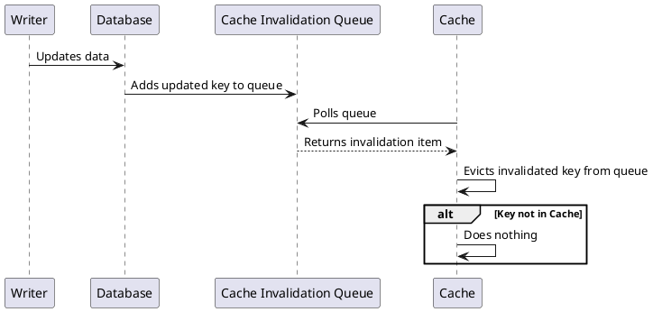
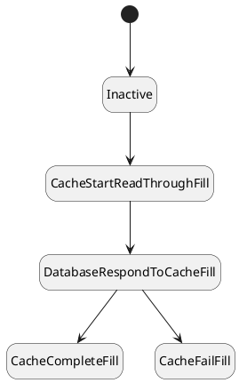
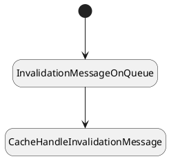
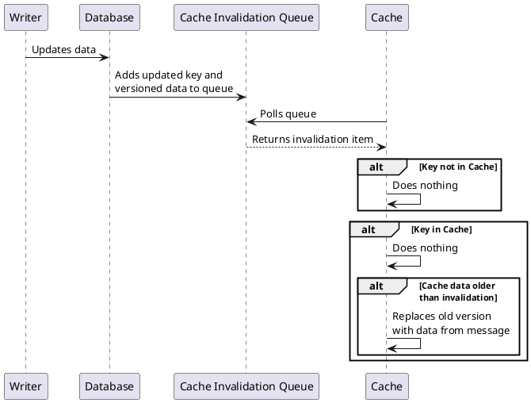
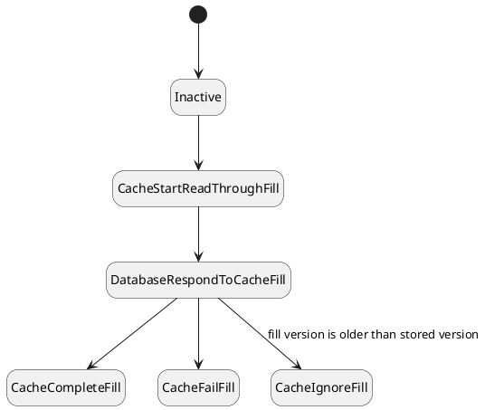
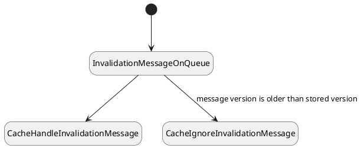



## Designing an initial cache invalidation solution
As we determined earlier, we need to be able to systematically evict out-of-date values from the cache. We do that with cache invalidation.

Whenever the database updates a value, it put an invalidation message on a queue. The cache will process messages from that queue: if it contains the key it will evict the value, otherwise it will do nothing.

Assumptions:
- Our invalidation queue does not guarantee in-order delivery.
- Our invalidation queue is durable and guarantees at-least-once delivery.

### Initial cache invalidation

## Initial cache invalidation solution
### Modeling
We are now dealing with multiple processes, cache fill and invalidation, that may interact. Therefore it is necessary to break the processes down into their component steps, which may be executed simultaneously. Also, for context, a Cache Fill describes the process of the Cache requesting data from the **Database**, the **Database** responding, and the **Cache** incorporating that data.

It is now worthwhile to model the cache's state machine.

There is also a very simple message-handling state machine:

Note that the cache requirements and the underlying data models that are checked stay the same.



### Verification
When we go to verify it we get an error:



Clearly we have a race condition between cache invalidation and cache fill. Let's try to rectify that.

## Updated cache invalidation solution
### An updated design

So our data has been versioned all along for observability. It's time to start using the versions in our solution.  This isn't unrealistic, as databases can send snapshot times along with results and invalidations.

Let's also start sending the data along with the invalidations, so that we can update the cache when things change.

Whenever a cache fill comes back, or an invalidation message is received, we will compare the version we just received to the version in the cache. We will only modify the cache if the version is higher. That way we don't need to be concerned with race conditions of that sort. Whichever comes back first will be compared to the one that comes back second, and the cache will eventually have the same value.

#### Updated cache invalidation

### Modeling

We should update the state machines to:

This is reflected in the code below.



### Verification
We run it and experience a different error.



## Summary

Our main problem remaining is that cache invalidation messages are ignored if the key is not in the cache. In this case, a cache fill can be completed incorrectly with the old value. More broadly, the solution doesn't take ongoing cache fills into consideration. We should address this in our next design.

  

| Next: [Working cache invalidation](../working-cache-invalidation) |
