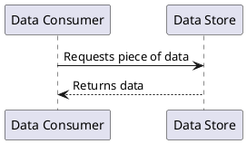
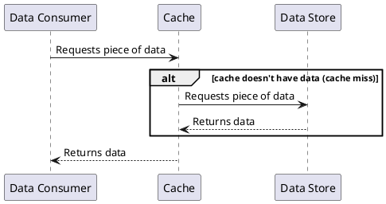
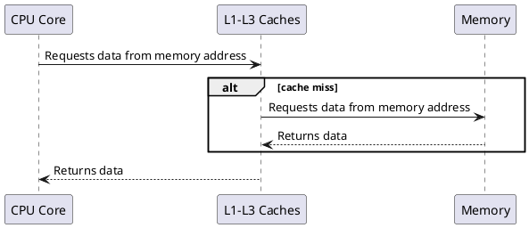
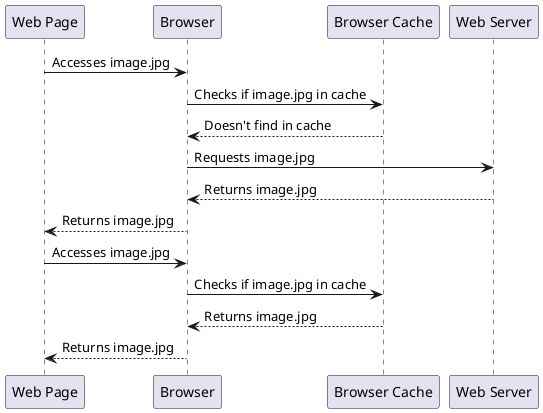
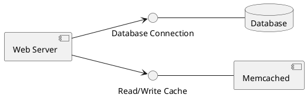
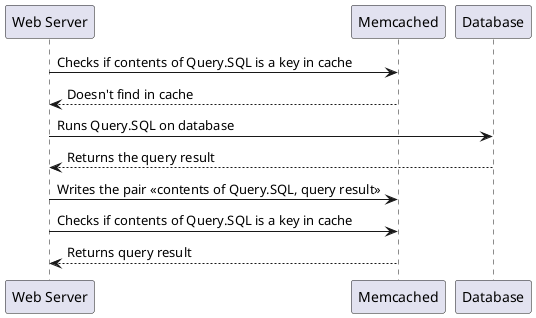
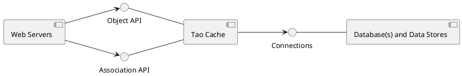
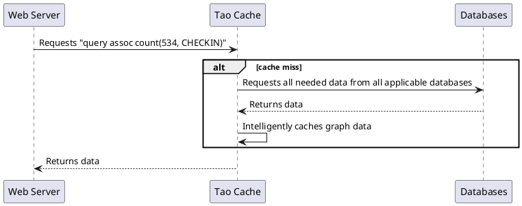
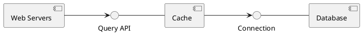
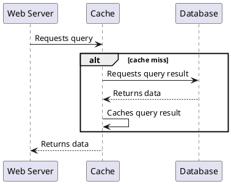



## Introduction

Caching is everywhere. Handling caches is one of the more complex and error prone parts of a developer's life, especially when maintaining web applications. Here we will attempt to explain why, and create and debug formal models for caching strategies. Why is the title of this article "Cache Invalidation"? As it turns out, that's the tricky part. Don't worry if that doesn't ring a bell yet! We'll explain it step by step.

This article was inspired by this [Facebook blog post](https://engineering.fb.com/2022/06/08/core-data/cache-invalidation/) on cache invalidation. As they mention, caching behavior is best thought of as a state machine, which makes it a perfect fit for modeling. I'd recommend you read the post twice: once before and once after you read this article. It is a short and well-written intro to the nuances of caching and cache consistency testing. It's also written by people who run caches that serve one quadrillion queries a day. One quadrillion is **1,000,000,000,000,000**. Statistically speaking, if a problem can happen, it will happen to them.

_Note: We'll be focusing on cache reads for this article. However, we will absolutely address what happens when the underlying data is written to (which is where cache invalidation comes up)._

## A simple explainer on caching

The simplest model of data access involves a **Data Consumer** and a **Data Store**. When the consumer wants information, it asks the store, which gives it the most up to data information it has. How simple is that?

### Data Access

### Cached Data Access

For a number of reasons, especially if the data is going to be accessed often, we put a cache between the data consumer and the data store.

Wow, that's way more complicated! Spoiler alert, there are way more failures that can occur due to that complexity. So why do we use it? Did Big Cache lobby Congress? Actually, there are profound benefits to caching. The main ones are higher speed and lower cost. Let's look at different examples of caches.

### CPU Caches

> _Note: L1-L3 caches are grouped in the diagram. Actual data access goes from Core -> L1 -> L2 -> L3 -> Memory_

Perhaps the most important caches in all of computer engineering are those located on the CPU and used to access **Memory**.

The caches are located on the CPU, with L1 and L2 caches generally located on each individual core. The closer a cache is to a core, the faster it is to access:
 
[(credit)](https://superuser.com/a/507477)

Advantages:
- Higher speed: Getting data from an L1 cache is approximately 100x faster than getting it from memory. That matters a lot for data that is actively worked on by the processor.
- Lower cost: Caching reduces the amount of times the core needs to access memory. However, lowering cost is not the primary reason for this kind of cache.

CPU caches are an example of Read Through caches because the CPU talks to the cache that talks to the memory. They are also [Write Through](https://www.geeksforgeeks.org/write-through-and-write-back-in-cache/) caches, though that is not covered here. If you are interested in this kind of caching, check out [Specifying Systems](https://lamport.azurewebsites.net/tla/book.html?back-link=learning.html#book): **Pages 56-64**. It also addresses writing, which is the more complicated use case.

### Browser Cache

Browser caches are the type of cache with which your average person has the most interaction. Web browsers such as Chrome maintain a cache of assets they download from the web.

Advantages:
- Higher speed: Don't need to download large files every time you visit a website or change pages.
- Lower cost: Reduces the load on the servers because they don't need to repeatedly serve the largest, and thus most expensive, files.

Browser caching is an example of a [Cache-aside](https://docs.microsoft.com/en-us/azure/architecture/patterns/cache-aside) pattern, where the application is responsible for managing the cache.
 
>_While this is critical to the modern web, it can cause strange problems if it is used even slightly incorrectly. There's a reason the first suggestion when a website stops working is to clear your cache._

### Database / Data Service Caching
This is the type of cache we'll be focusing on in this article. Databases are expensive and hard to scale, and they are also generally a performance bottleneck. So you put a cache in between your web servers and your database. You see both Cache-Aside and Read Through caching here.

#### Cache-Aside
This is the most common. We are trying to cache database queries, and there is no "right" way to do that. For a simple example, let's say we wanted to get the names of all employees located in Palo Alto. The query might look like:
> Query.SQL: **SELECT Names FROM EMPLOYEES WHERE Location='Palo Alto'**

Ok, that's probably not going to meaningfully change on a second by second basis, so there's no need to keep hitting the database. Our system looks like this:

The database is a standard relational database. Memcached is a key value store. We use the entire query string as the key, and the result of the query as the value.

While potentially you could program a cache like this one to be Read Through, maybe using the query string as a key, it could be a really bad design decision for your workload. Maybe it's better to break it up. This is an application level decision.

#### Read-Through
If you have more homogenous ways of accessing your data, a read through cache becomes possible. The biggest example of this is the [TAO](https://www.usenix.org/system/files/conference/atc13/atc13-bronson.pdf) graph cache developed by Facebook. While the query language for TAO is not [GraphQL](https://graphql.org/), it's probably not a bad way to think of it. A more semantic, structured lookup language allows you to make company-wide  decisions on how to cache, rather than just application-level. To steal an example from the paper, if you wanted to know the number of location checkins at the Golden Gate Bridge, the query might look like this:

> **assoc count(534, CHECKIN)**

Facebook's system looks like this:

The TAO cache is the only actor the web servers talk to. It caches the data required to answer the query and returns it to the server. Because it understands the semantics of the query, it might be able to answer more with the data it just cached, like: "Has Debra been to the golden gate bridge?"

>_Read Through caching is much better than Cache-aside if you can use it. It's also cleaner to model and analyze, so we'll be using it for the following models. In addition, Facebook allows Write-Through with the Tao cache, which, is out of the scope of this article to preserve the reader's sanity._

#### Advantages of Database Caching
Why is this type of caching so important to backend engineers? 

- **Higher performance**: A database query can take 3ms to 5 seconds depending on its structure. A memcached query can take < 1ms and is consistently fast.
- **Lower cost**: This is the big one! Let's do some back of the envelope calculations on cost:

    >  Facebook handles _1e15 queries per day_. There are _86,400 seconds per day_. _We can round that to 1e10 queries per second_.

    > A 3 node postgres cluster, tuned for performance, can perform _5,000 queries per second_. Let's call it _2,000 queries per second per node_. We're going to ignore the difficulties of scaling databases and assume we have REALLY good sharding. If we were serving everything from the database, we would need about 5 million servers. If we say each node costs $2,000 per year to run, that's *$10 billion per year*.

    > A memcached node can handle approx _200,000 queries per second_. We would need a much more manageable 50,000 servers. At $2,000 per node a year, that comes out to the positively bargain price of *$100 million dollars per year*. 

    Caching may be a hard problem, but it is absolutely critical to making SaaS products cost-effective. Your company may not be playing for Facebook-level stakes, but it can absolutely make a difference once a reasonable level of scale has been reached. _[xkcd](https://xkcd.com) gets it:_

    

    

## Key concepts and assumptions in database caching
> _Note: Some of this can apply to other kinds of caches, but extrapolate at your own risk._

While we covered the read case in some detail, there are several other considerations that will need to make it into every model.

### Modeling assumptions

We will be assuming a Read-Through cache for the following models. While this is not the most common type of cache for this purpose, all the cache consistency issues that apply to Read-Through caches also apply to Cache-aside caches. This choice lets us skip past the application-level decisions made by Cache-aside caches. With that said, this article may still help you if you want to model a Cache-aside cache for your specific application.

### Cache eviction

Ok, I cached an item. Does it live in my cache forever? No, and there are two main reasons for this:
- Your cache is full: Imagine a 10GB cache fronting a 1TB database. At any one time 1/100th of the data can be cached for quick access. What happens when you need to cache something new? It depends on the caching strategy, but [Least-Recently-Used (LRU)](https://en.wikipedia.org/wiki/Cache_replacement_policies#Least_recently_used_(LRU)) is a standard one. When you need to remove data to add new data, remove the data that has been least recently read. Generally, that will let more relevant data stay in the cache, while less relevant data is evicted. This is important even for giant cache systems  spanning thousands of machines. Maybe the North American cache can hold 95% of all the data North Americans want to see, but that 95% keeps changing, so the cache must change with it.

- Time to Live (TTL): One simple way to keep your cache up to date is to set a TTL policy. Imagine you never wanted your data to be more than 1 hour out of date. Set a TTL of 1 hour, and after an hour, the data will be retrieved again. This is a blunt but powerful tool.

- Accidental Eviction: Caches are generally not built for durability. A cache server can fail, potentially removing the keys it held from the cache. Replication can help with this, but in general caches choose to give up durability for performance. Durability is what the database is for.

In general, we should assume a cached item could be evicted at any time for any reason. That doesn't mean we can't model specific reasons for eviction, but we also need to account for random eviction.

### Cache invalidation
As convenient as it would be if people only read from databases, it turns out that people write to them too. Which means the database values change. Which means the cache can become out of date. If the cache needed to be immediately consistent with the database it would effectively need to be an extension of the database, with all the accompanying complexity and [CAP theorem](https://en.wikipedia.org/wiki/CAP_theorem) scaling difficulties. Databases do this, but it is hidden behind the standard database interface, and not what we're discussing right now. The standard database caches and caching strategies aim to be [eventually consistent](https://en.wikipedia.org/wiki/Eventual_consistency), meaning that given time, the data in the cache will reflect the data in the database (unless of course the database changes again).

Theoretically, eventual consistency means your cache could be minutes, hours, or even days behind the database as long as it would eventually catch up. In practice, seconds to minutes are considered acceptable. However, setting a very short TTL reduces the benefit of caching.  Some applications can work with a longer TTL if updates that depend on old versions of the data are detected and cause a user error and a cache refresh. For example, choosing a seat on a air flight might show a out of date seat map, but an attempt to book seat that is filled will be caught and the user will be asked to rebook. In many systems, though, this is not a desirable property. Twitter wants to show you the latest Tweets.

For that reason, automatic cache invalidation systems exist. Generally, one or more applications read the database logs and look for changes. The application then broadcasts to the caches that a change has occurred and they should evict their old value. The next time someone queries for that data, the cache will read through to the database and get the latest value.

## Initial parameters for all exercises

We will work with the simple Read-Through cache below:

 

This will be how reads are executed for all the exercises, as this behavior is inherent to a Read-Through cache:

Finally, our eviction strategy will be modeled by cache keys randomly being evicted. This covers both the cache running out of space and the cache failing for other reasons. As our primary concern is cache consistency with the database, and not cache availability, it's not necessary to model capacity or more complex eviction strategies. _Note: If we were testing cache eviction strategies, modeling capacity would be essential._

## Summary

Now that we have our caching basics covered, let's model them, test them, and handle the problems that arise! As usual, we will start simple and work our way up.

  

| Next: [A naive model of caching](naive-model) |