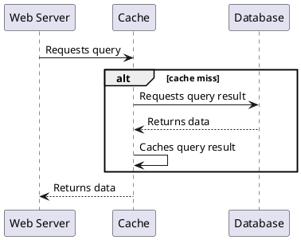



## Designing a naive cache

In addition to the [parameters described previously](../#initial-parameters-for-all-exercises), we will make a few design decisions:
- Caches will only be filled during reads (as pictured below).
- We will not worry about cache invalidation.
- We will only model a single cache. We are assuming it is either one server, or one consistent replica set. _Note: While there are generally many cache servers, the complexity of cache invalidation (at this level) can be modeled with just one cache and one database._

So essentially the only operation we are implementing is the read described in the last section.

Now we have all our design parameters. Let's model!

## Success criteria
Because caches are so well understood, we can come up with our success criteria before modeling. Note how it defines certain key data models, so success can be defined.



> Note: the requirements are their own TLA+ module. In all our models, we will import it. We can think of it a bit like an interface in a standard programming language.

## Modeling the cache
We model the cache, importing the cache requirements module rather than redefining the expressions it provides.



## Verifying the cache
First let's try setting DatabaseAndCacheConsistent as an invariant and see what happens. This says that the cache and the database must always be consistent with each other.



This is what we'd expect. The **Cache** and the **Database** are not always consistent with each other. If this passed, we should doubt the model.

What if we use the eventually consistent property _AlwaysEventuallyDatabaseAndCacheConsistent_? We get another error. Temporal property violations are not as clear as logical ones.



Because we have no way of guaranteeing that a key will be evicted from the cache, as soon as the key is set, the cache will not change. 

## Summary
As we can see, our current model of cache is not eventually consistent with the database. We need to systematically clear the cache of outdated values. We need _cache invalidation_.

  

| Next: [Adding cache invalidation](../cache-invalidation) |