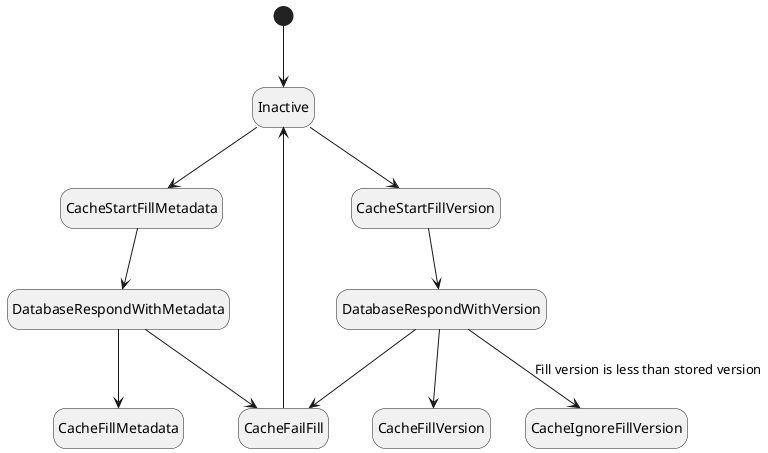
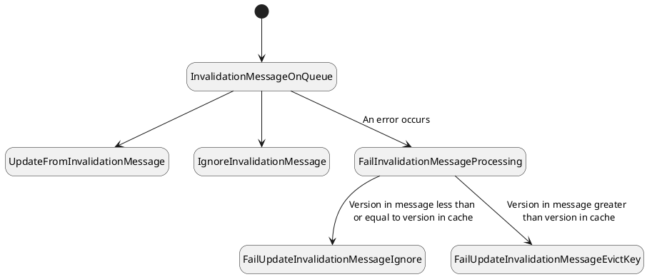



## Introduction

The [Facebook blog post](https://engineering.fb.com/2022/06/08/core-data/cache-invalidation/) that inspired this series ended with a bug caught by Polaris, Facebook's cache inconsistency observability tool. Like any bug found in production, it would be better if it could be caught in the design process. In this post, we'll try to make a model with sufficient detail to catch this bug. 

> _This reconstruction is best thought of as historical fiction, the "what if the British won the Revolutionary War" version of Facebook's cache behavior. Take it with a bag of salt._

## Detective work
### The bug report
_Taken directly from [this blog post](https://engineering.fb.com/2022/06/08/core-data/cache-invalidation/)._

Precondition: The cache filled metadata.


1. The cache tried to fill the metadata with version.
2. In the first round, the cache first filled the old metadata.
3. Next, a write transaction updated both the metadata table 
   and the version table atomically.
4. In the second round, the cache filled the new version data. 
   Here, the cache fill operation interleaved with the database
   transaction. It happens very rarely because the racing window
   is tiny. You might be thinking, “This is the bug.”. No. Actually, 
   so far everything worked as expected because cache invalidation is 
   supposed to bring the cache to a consistent state.
5. Later, cache invalidation came during an attempt to update the 
   cache entry to both the new metadata and the new version. This almost 
   always works, but this time it didn’t. 
6. The cache invalidation ran into a rare transient error on the cache 
   host, which triggered the error handling code.
7. The error handler dropped the item in cache. The pseudocode looks like this:
    
   drop_cache(key, version);
    
   It says drop the item in cache, if its version is less than specified. 
   However, the inconsistent cache item contained the latest version. So
   this code did nothing, leaving stale metadata in cache indefinitely. 
   This is the bug. We simplified the example quite a bit here. The actual
   bug has even more intricacy, with database replication and cross region
   communication involved. The bug gets triggered only when all steps above
   occur and happen specifically in this sequence. The inconsistency gets 
   triggered very rarely. The bug hides in the error handling code behind 
   interleaving operations and transient errors.


### Deriving Assumptions

| Assumption | Evidence |
|:-------------|:------------------|
| Database updates metadata and version transactionally | Step 3 |
| The metadata stored in cache, and the version of that metadata, are filled separately (non-transactionally) |  Steps 1 and 4 |
| The metadata stored in cache, and the version of that metadata are filled with separate database requests |  Steps 1 and 4 |
| The cache fill of metadata or version can fail | Step 5|
| Cache invalidation messages contain both the version and the metadata | Step 5 |
| Cache invalidation message processing can fail in a way that is not automatically resumed | Step 6 |
| When cache invalidation fails, an error handler is called that conditionally drops keys lower than the version on the message | Step 7 |

Additionally, we can gather information from other sources.

| Assumption |  Evidence |
|:-------------|:------------------|
| The cache invalidation messages are guaranteed to be eventually delivered | [TAO](https://www.usenix.org/system/files/conference/atc13/atc13-bronson.pdf) design paper

The main question it raised: How exactly does Facebook use versions in the cache, if they are allowed to get out of sync? The answer seems to be: leaning heavily on their cache invalidation solution (Steps 4 and 5). Because the cache will get every invalidation message, no matter how far the version and metadata are out of sync, the LATEST cache invalidation message should fix it. From that we must infer:

_Cache invalidation replaces metadata values of at most equal or lesser version._

The fundamental bug is therefore the fact that the error handler that handles cache invalidation errors drops only **lesser versions**, while the cache invalidation contract requires replacing **equal or lesser versions**.

Let's see if we can catch this with a model.

## The model

All the descriptions and assumptions are done at a simplified level, as in the blog post. Therefore we will model this level of detail. _Note: Simplification in of itself does not make a model invalid or even less helpful. Models should be constructed to catch bugs at a particular level of abstraction. It is possible that a system may need multiple models, at different levels of abstraction, to describe it. Sometimes you can even connect them together to find bugs in their interactions, though this is very advanced._

As we create a model in an attempt to recreate a system, our biggest risk is [overfitting](https://en.wikipedia.org/wiki/Overfitting)—that is, tailoring our implementation too exactly to get our expected result. We can mitigate this somewhat with Occam's Razor: trying to find the simplest model that fits the assumptions

The other assumption we make is that the reported bug is the only bug in Facebook's logic at this level of abstraction. Where data is not available from Facebook's caching papers, we may substitute a fix from the prior articles in this series.

We get state machines that look like this:

One thing thing to notice in the model is that we import the same _cacherequirements_ we have used for the entire series. They should be sufficient to help us find the bug.



Note how the entire Facebook model fits in 320 lines of code. Also, note how similar it looks to the models we've been using this whole series. It feels like the whole model is at the same level of abstraction; we haven't had to disproportionately model certain pieces just to model our assumptions.

## Can we find the bug?

And when we run it we get a bug report that we can actually map, item by item, to the bug reported by Facebook.


This trace (or some version of it) is the first thing that comes up when you run the model above. 

## Retrospective

There are several key takeaways:
- **Implementing another module:** Again we used the exact same cacherequirements module for all iterations of our caches. This shows the power of writing requirements in TLA+ and having other modules implement them.
- **Compactness of specifications**: The entire set of requirements and implementation was 370 lines of code with plentiful comments. The detail and level of abstraction remained relatively consistent, supporting the representativeness of the spec.
- **Potential to catch bugs before production**: The specification is of sufficient detail that the coder of the error handler could have ensured (and even unit tested) conformance to the spec.

While this is obviously a simplified model of the actual behavior, there are two potential conclusions to draw:
- Modeling at this level of abstraction is useful, and other verification methods could be used to account for the additional complexity such as regions, network partitions, database replication, etc.
- The model could be enhanced to a higher level of detail that reflects those complexities, modularized to allow for testing at different levels of abstraction, and then holistically tested (likely over days on a high end machine).

> _A final reminder that this is still historical fiction, and likely deviates from the Facebook implementation (even at this level of abstraction) in a number of ways._

| Next: [Time for some Business Logic](../../business-logic) |