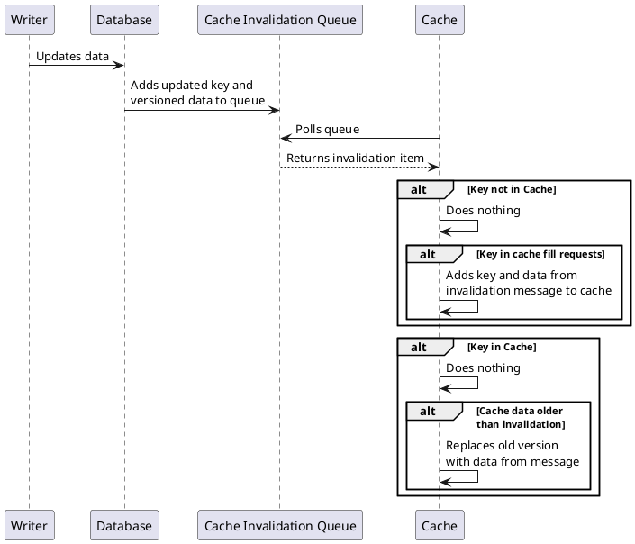



## Designing a working solution

We need to account for inflight cache fill requests. Let's remind ourselves what we know about them:
- They are triggered in response to a read request.
- They happen synchronously or at least near realtime so a response can be sent back to the client.

From a design perspective, then, we can set certain parameters:
- No key corresponding to an inflight request will be evicted, as it is needed to respond to an active request. Therefore the key belongs in the cache. 
- We should process invalidation messages for keys corresponding to inflight requests. We know the key will be added to the cache soon, so it may be relevant.

### Working cache invalidation

## Modeling

We do have one modeling consideration. We mentioned that keys could be evicted at any time, which accounted for server crashes as well as caching policy. We can model a server crash as a cache fill failure followed by an eviction. Therefore, we can already account for this scenario without needing to extend our current model.



## Verification

We run a larger test on this model.

SPECIFICATION Spec

CONSTANTS
    KEYS = {k1, k2}

INVARIANT
    TypeOk

PROPERTY
    AlwaysEventuallyDatabaseAndCacheConsistent

CONSTRAINT
    DatabaseRecordsDoNotExceedMaxVersion


And it passes:



We trust this result more because we have seen earlier versions of the system fail in rational ways against the same invariants and properties.

## Retrospective

There are a couple of key modeling takeaways from this series:
- **Implementing another module:** We used the exact same cacherequirements module for the 4 iterations of our caches. Not only does this follow _do not repeat yourself (DRY)_ principals, but it also shows how we can maintain requirement consistency across many implementations. While this was a simple example, it is possible to import much more subtle requirement modules such as "linearizable" and map them into your specific module. They can then provide Invariants and Properties that let you know if your solution is working correctly.
- **Compactness of specifications**: The entire set of requirements and common data properties was 50 lines long with extensive comments. The final working cache specification was 220 lines long. This modeled and tested reasonably sophisticated cache invalidation logic. This is much less verbose and time-consuming than implementing the logic and tests in a standard programming languages. This is part of why formal modeling is a great next step after whiteboarding or diagramming. The output is small enough to be read, critiqued and tested in one sitting.
- **Fairness**: While it can be tempting just to write _WF_vars(Next)_ as part of your specification, you often need to break it up further. If we were to write that, evictions would HAVE to occur, or worse Database updates would HAVE to happen, meaning that we would not necessarily be able to catch temporal property violations. Without fairness, the cache could simply never update, which would break eventual consistency. That circumstance is something we have to prevent in code and/or with monitoring solutions. We can represent that effort as _WF_vars(CacheFairness)_, providing fairness to all operations that MUST eventually occur.

So where do we go from here? There are two options. The next (and final) page in this series is about replicating the bug described by the Facebook paper.

| Next: [Reproducing Facebook's bug](../reproducing-the-bug) |