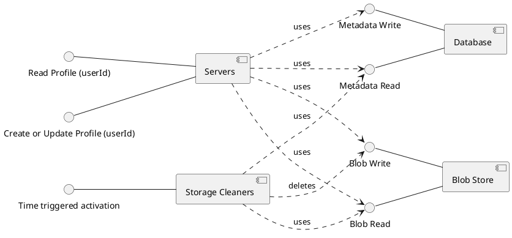

# {{page.title}}

## The new requirements hit
You've hit the big time. Absolute perfection. You've just built the database blob store coordinator [to beat them all](../working). Nothing is going to bring you down... until your boss walks into your office.

"I just talked to Jim in DevOps," she says ominously, "and we're getting hosed on our data storage costs. Apparently this last update writes a new object every time someone updates their profile. Even if they update it again, all the old stuff sits around."

"But it's way more correct this way," you respond defensively. "I modeled and verified it. That means I'm right, I win the conversation. Good day sir/madam."

"Not so fast, bucko," she retorts. "You know what I always say: 'Time is money, money is money, and cloud storage costs are money.' You're going to have to figure it out."

"But please, boss," you plaintively mewl, "I just got this working correctly. I proved it and everything. Running that last test took twelve hours. Who knows what will happen if I go mucking about in there?!"

She looks at you with a mixture of contempt and pity. "Don't you know one of the best characteristics of formal models is that you can build on existing models, make them more robust, and use them to verify change?"

A realization hits you. You underestimated her technical skills due to her alignment with company priorities and the profit motive. She was absolutely correct: modeling is very useful for evolving designs. Duly chastened, you get back to work, and we go back to using a collective pronoun.

"One more thing", says our boss with an evil glint in her eye. "Team Ninja-Dragon is integrating their latest sprint. The **Server** codebase is frozen. You won't be able to add any more functionality on that component."

## Updated system components

So we have to implement data cleanup without adding functionality to the **Server**. This means we need to create a new microservice, the **Storage Cleaner**. It will need to be able to read from the **Database** and **Blob Store** to find orphaned files, then delete them from the **Blob Store**. It will likely be triggered periodically, perhaps by a cloudwatch alarm; however, at large enough scale it may stay on permanently. The component diagram looks like this:

We have two main design considerations at this point:
- We will have to plan for more than one **Storage Cleaner** to be active simultaneously. They could be run in a replica set, or delays could cause triggered instances to overlap.
- We will need to ensure that the behavior of **Storage Cleaner** doesn't break the invariants we tested previously.

## A formal definition of success

Before starting work, it's good to understand the definition of success. Because of our previous modeling work, we can now state it formally.



Ideally, we'd like to never have an orphan file. Let's test that really quick.



Failing on the first write sounds like a bad success criteria. Instead we'll go with **AlwaysEventuallyNoOrphanFiles** as our definition of success.

  

|Next: [(Implementing New Requirements) A naive update](../storage-cleaner-naive) |