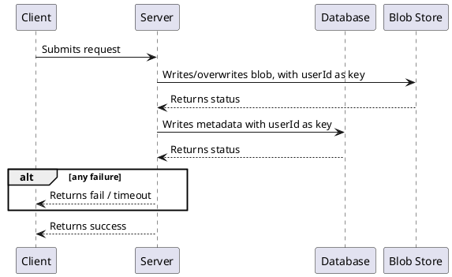
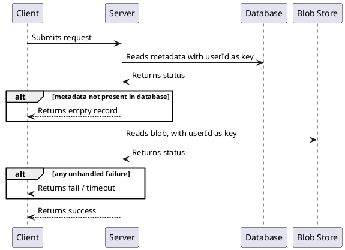
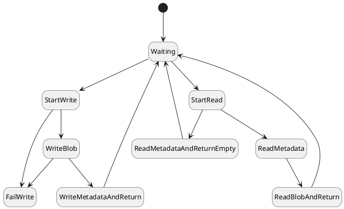

# {{page.title}}
{: .no_toc }

1. TOC
{:toc}

## Refining the design

Okay, so the big problem seems to be that the database is written before the blob store. This allows records to be read before they are ready. It also allows the system to fail in a state in which records that should not be readable are readable.

Let's update our design such that:
1. The blob store is written before the database.
2. If the metadata isn't present in the database, the server returns an empty record.

This should fix both of the problems we saw before.

### Write Profile

### Read Profile

## Updating our model
We can refine our existing model to implement this behavior. First we update the state machine:

Then we update the formal specification.

> _Note: Comments have changed to reflect the narrative. See the previous page for more comprehensive comments._



## Checking our improved design

### Starting small

Let's start with our our single server case again.



We don't have a perfectly working solution yet, but notice that the previous solution failed in 7 steps, whereas this solution failed in 10. Generally, the more steps that need to occur before failure, the more unlikely the failure—but not always. Let's take a closer look at the steps. In this case, the single server needed to write successfully, then write unsuccessfully, then read. In the previous one, the server just needed to write unsuccessfully, then read. But once we spell it out, that doesn't increase our confidence. Of course users are going to write multiple times, over days, so effectively all we need is a write failure for an error to occur.

### Testing multiple servers

It may be informative to see how multiple servers fail.



Now it fails in 9 steps rather than 6. But again, all it needs is a successful write to happen before the simultaneous read and write. The error hasn't fundamentally changed that much.

### Summary

So we've eliminated one class of error: the kind in which the blob store is unset and returned in a read. The problem now is that the blob store and the metadata can get out of sync. This can happen because of either a failure while writing, or one server writing while another one is reading. We're not done yet. But I have a hunch we can make it work.

  

|Next: [(Verifying Correctness) A working solution](../working) |