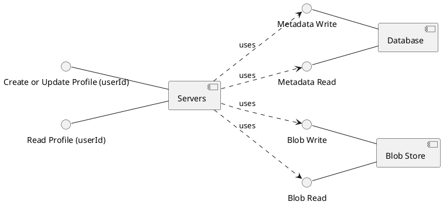

# {{page.title}}
{: .no_toc }

1. TOC
{:toc}

## Introduction

Let's start with something that millions of engineers do each year: coordinating databases and blob stores (like Amazon S3, Azure Blob, GCP Cloud Storage). Why might we need to do this?

You have a site with users. You want each user to have a profile image. How do you do this? The easiest way is to store the user metadata and the image in your database. You can do this transactionally: either the metadata and the image are both stored, or neither is stored. This way you don't have to worry about inconsistent cases where the image is stored, but the user isn't, or the user is stored, but the image isn't.

In practice, this approach doesn't scale easily or cheaply. Transactional databases are typically the performance bottleneck in a system, and you don't want to take up their storage, read, and write capacity unnecessarily. What if users need to add more media beyond just a profile picture? This can quickly become an expensive prospect. Blob stores, on the other hand, are relatively cheap and highly scaleable and can easily hold as many files as you'd practically need. They also don't consume database CPU cycles. Just one problem: they aren't tied in with the database's transaction coordinator. You as the programmer need to figure out an application level solution to link the database and blob stores, so when a request comes in for a user and their profile picture, you can return it. This is a simple and common distributed system, which makes it a perfect place to start.

## Modeling the problem

We have three components in this system that we must consider: the **Database**, the **Blob Store** and the **Servers**. Note we consider the **Database** and the **Blob Store** each as individual entities. If we were to look at their implementation, we would potentially see shards and replication over a number of instances. However, the designers of those products expose interfaces with particular properties that can hide this complexity. 

- **Database**: Allow [ACID Transactions](https://databricks.com/glossary/acid-transactions). The important part for us is that the full database update either will succeed or fail; we don't need to account for a partial completion of the update.
- **Blob Store**: All the main blob stores have [Read After Write](https://levelup.gitconnected.com/aws-azure-gcp-object-storage-services-5f1b2945cc11) consistency. This means that as soon as a write returns successfully, all subsequent reads will return the new value. This shouldn't be taken for granted in eventually consistent systems; it may take time after a write is completed to be sure that value will be returned in all cases. Additionally, all the blob stores are atomic on writes, meaning we don't have to account for files being partially uploaded and left in an invalid state that clients could read.

The **Servers**, however, are our responsibility. They use the read and write interfaces exposed by the data stores however our application is written to use them. Note the plural in Servers: we have to deal with the fact that multiple instances of our application are running simultaneously. We are assuming a single thread per Server, processing a single request at a time. Although in practice many threads could be on a single **Server**, it is logically equivalent to the case where there are multiple **Servers** each with one thread.

We can model this with the [UML Component Diagram](https://www.smartdraw.com/component-diagram/) below:

We are implementing two interfaces with our server: *Write Profile* and *Read Profile*. 
- *Create or Update Profile (userId)*: leads to one of the following post conditions:
    - The database contains metadata about the profile. The blob store contains the profile image. There is some way to link the two.
    - The API call fails in such a way that both datastores are left in a consistent state that does not disrupt *Read Profile* or prevent a successful retry.
- *Read Profile (userId)*: For a given profile, both the metadata and the profile image are returned. It is unacceptable to return one without the other. Returning None is acceptable when a good result is impossible, but unacceptable  otherwise.

Note that we are not modelling the clients of these APIs. However, the consistency guarantees set out above would allow someone else to do so.

  

| Next: [(Start of Process) The naive first draft](naive)|
