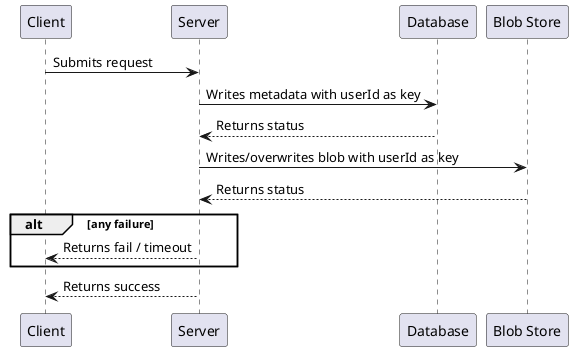
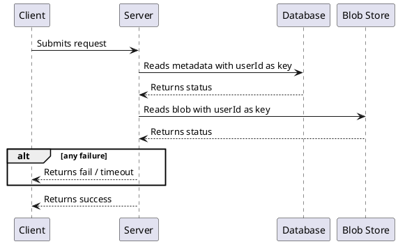
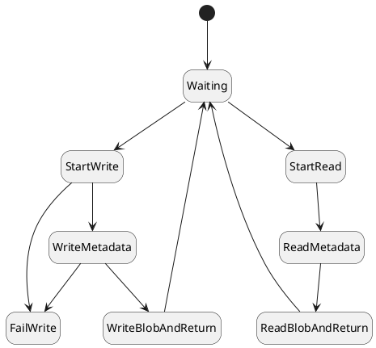
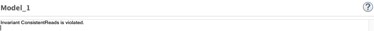
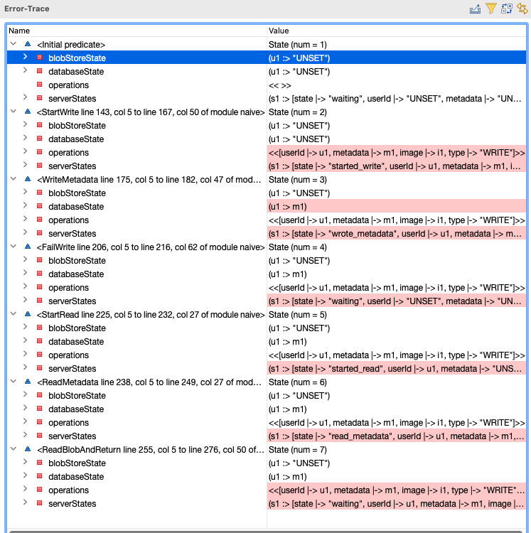

# {{page.title}}
{: .no_toc }

1. TOC
{:toc}

## Solution design

Let's start by writing the hackathon solution to this problem (but specify it with way too much detail). We will describe what's going on using a [UML Sequence Diagram](https://developer.ibm.com/articles/the-sequence-diagram/).

### Write Profile

This represents a client, most likely a website, submitting multi-part form data consisting of a profile image and JSON metadata describing the contents of the profile.

### Read Profile

This represents a client, most likely a website, requesting a user profile, receiving JSON containing the profile metadata and a base64 encoded version of the profile image.

### Design Decisions
Let's talk about a couple design decisions made here. One is reasonable, but the other two will backfire.

The reasonable one is as follows: If any failure happens during the process, we return a fail message to the client or timeout. While we could attempt to retry certain failures, the server itself can die any time during the process. The client and our consistency model are going to need to handle this case no matter what. There are schools of thought that say this is how you should always build your system: [see Crash-Only software](https://en.wikipedia.org/wiki/Crash-only_software). This can make designing and testing software simpler and safer but is certainly not a one-size fits all solution.

The two that will backfire:
- We are using the userId as the key for the metadata and the blob, so that we can trivially get / set / overwrite all the necessary information.
- We are writing to the database prior to writing to the blob store.

## Solution modeling
When modeling in TLA+, generally you construct one or more state machines, which will then be run with simulated concurrency. It can be helpful to draw state diagrams to help you code. What we are modeling is a state machine that describes the behavior of a **Server**.

Now it's time to model the system formally. I've written the narrative into the comments, so even if you don't know TLA+, please read the comments in order.



It should be noted that ConsistentReads is a relatively weak success criteria. All it says is that anything returned by Read must have been written in one go. It doesn't say how recently it needs to have been written. It doesn't say that reads couldn't go backward in time and regress. Yet this invariant is sufficient to catch all the flaws that will arise in this design. We don't need to model every aspect of the system, only the aspects we are concerned about. In this case it is making sure the blob store is consistent with the database. Common sense may be used to say that the design keeps the storage up to date.

## Logically debugging the solution
### Starting small

Remember the CONSTANTS section above? Now it is time to define them.


CONSTANTS
    SERVERS = {s1}
    METADATAS = {m1, m2}
    USERIDS = {u1}
    IMAGES = {i1, i2}


As you can see, each of the constants is a set. What really matters is the cardinality (size) of each set. By only having one server and one user, we are testing on a very small version of our problem. It's good to start small, and then expand the tests as your small tests succeed. Note that we have two metadatas and two images. If we only had one, it would be as though there were only a single profile and single image that could be uploaded. That would likely lead to a lot of tests passing that really shouldn't. Determining the size of the simulation is a bit of an art, but if it doesn't work for a single server and a single userId, we know we're in trouble.

And oh no! We're in trouble. When you run the model, the error trace shows up in the model checker UI as shown below. Don't bother reading it in detail, because we have a better way of exploring it.

For our purposes we will be visualizing the model checker errors as shown below. The writing with a lighter font weight (and right aligned on desktop) are notes describing the failure and part of the narrative.



So we know we have at least one design flaw. If a Write fails after the database has been written to, but before the blob store has been written to, the next reads will be corrupted. This is true even if there is a single server. We will try to address this flaw in the next session.

### Increasing the size of the simulation

Normally after a failure, you'd attempt to correct your design before running another simulation. But I'm curious if the system fails faster or in a different way when there are multiple servers.


CONSTANTS
    SERVERS = {s1, s2}
    METADATAS = {m1, m2}
    USERIDS = {u1}
    IMAGES = {i1, i2}




Good thing we ran this simulation. Even in the absence of failure, there is a race condition that can lead to incomplete data being returned. Looks like we have some work to do!

  

| Next: [(Progressive Refinement) An improved solution](../improved) |