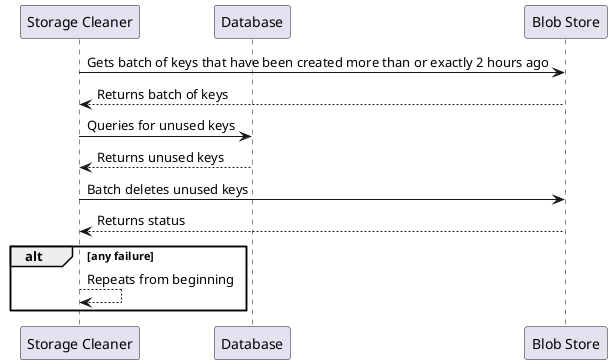
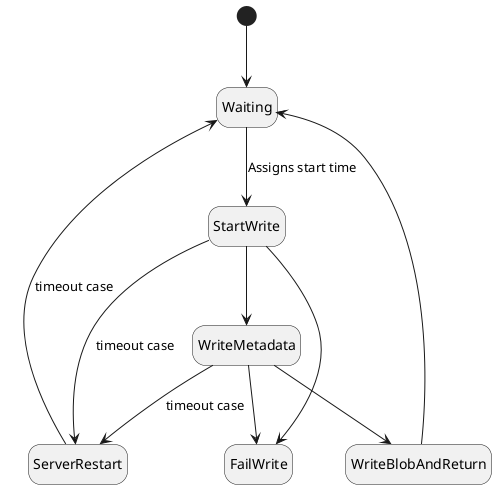

# {{page.title}}
{: .no_toc }

1. TOC
{:toc}

## Refining the design

How do we prevent the cleaner from deleting items just as they are being written? Well, the common sense solution is to check the creation time. We should only start cleaning a key after a safe window of time has passed since its creation. Let's call it 2 hours.

### Storage Cleaner Run

### Assumptions

We are making one main assumption: that all of our clocks are accurate within a reasonable margin of error (5 minutes is generous), and our code errs on the side of not deleting based on those margins.

While you can't always make assumptions about clock time in distributed systems, in this case our time frames are so large (hours) that it's probably not a bad assumption. Note: this doesn't mean a program will necessarily check its clock. It could stall and then resume what it's doing an hour later.

## Modeling the design
Now we have to introduce a concept of time in the model. You might think we've been using time throughout this whole tutorial, but actually, we were just using ordering. We will need to add the concept of creation time to the blob store. Keep in mind that the state diagram has not changed.

> _Note: This isn't adding functionality. We're just modeling details that have become relevant._



## Verifying Storage Cleaner

We're going to start off with the slightly larger model (two servers and two cleaners), since the last test didn't show behavioral differences. Might as well perform the more rigorous test.



The error we saw previously is gone, implying we fixed the design flaw we hoped to fix. This new error is much more complex. It requires the **Server** to stall at just the wrong time and be out of commission for 2 hours. This is pretty unlikely; in fact, it's unlikely enough that some companies might be okay with it. But the fix is obvious: kill the servers after 1 hour of stalling or less. Chances are we were going to do it anyway in implementation, but let's model it to get the extra assurance.

## A quick fix
All the changes in the model are in the server behavior. Despite the large number of changes, all we're really saying is that if less than an hour has passed since the server request started, it can proceed to the next state. Otherwise, it proceeds to the restart state.

This can be reflected in an updated state diagram for Server writes:

This is reflected in the code below.



Looks good, right? Let's test it.



We've gotten closer, and our error is even more obscure. Now it requires an interaction of **Storage Cleaner**, a **Read Server**, and a **Write Server**. But there's a relatively simple fix.

> _Note: This was the first error that I did not expect. But it is exciting that TLA+ wouldn't let me get away with it!_

  

| Next: [(Implementing New Requirements) A working update](../storage-cleaner-working) |