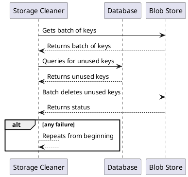
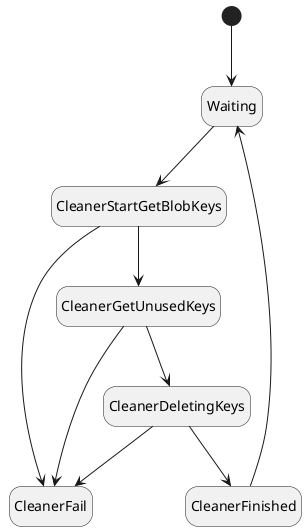

# {{page.title}}
{: .no_toc }

1. TOC
{:toc}

## Updating the design

The **Storage Cleaner** is going to to query the blob store and get a batch of keys. It will then query the database in one query and find all the images that are missing a database entry. Then it will delete those unused keys using a batch API call.
### Storage Cleaner Run

## Modeling the design

This is the first example in our modeling tasks in which the model will not match the solution 1-1.
- **Relaxing a constraint**: While the design calls for batches, for simplicity's sake we will model it as if the entire blob store keyset can fit into one batch. This hides the complexity of figuring out which items have already been checked and how large of a batch size to use; we can either handle these considerations in implementation or model them separately. In this model, we will need to handle new keys being added after we query for keys, as well as the deletion process failing before all key are deleted. This should also alert us to problems that may be introduced by batching. _Note: This design decision is a judgment call that may or may not be correct, but it holds for the current examples._
- **Enhancing a constraint**: Deleting from the blob store will be modeled as a one by one operation, even though it is submitted in one API call. This is because blob stores don't provide transactions. A batch delete may happen over the course of time.

The **Storage Cleaner** state diagram looks like this:

Only the core additions to the spec are shown here. Click _Download Code_ or _Download PDF_ to see the whole thing.



## Verifying the design

Let's start small and see what happens:


CONSTANTS
    SERVERS = {s1}
    CLEANERS = {c1}




Let's try it again with two servers and two cleaners to see if we get different behavior.


CONSTANTS
    SERVERS = {s1, s2}
    CLEANERS = {c1, c2}




Adding more servers and cleaners didn't change the failure mode. We've likely hit upon the essential failure of this design.

### Summary

Clearly this solution isn't going to work as is. It can delete images that were part of records being created at that moment. Normal cleanup systems don't do that; normally they wait a little while...

  

| Next: [(Implementing New Requirements) Significant improvement](../storage-cleaner-improved) |