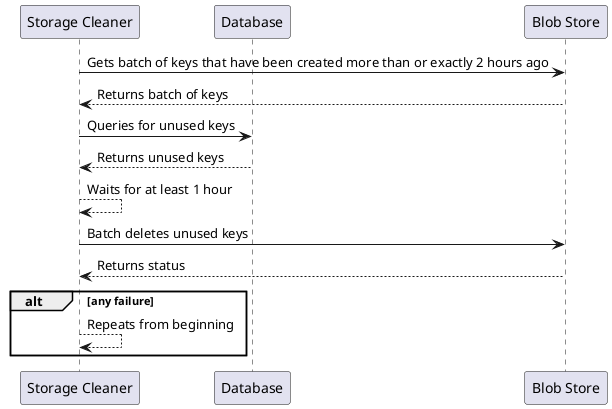

# {{page.title}}
{: .no_toc }

1. TOC
{:toc}

## A last fix

Our remaining problem is that Read operations can hang for an hour and thus have references to images that are out of date and have been deleted. We can fix this by introducing a delay of 1 hour between getting the unused keys and deleting them.

### Storage Cleaner Run

## Modeling the design
This is a relatively simple update to **Cleaner**. The relevant snippet is shown below. Click _Download Code_ or _Download PDF_ to see the entire program.



## Verifying Storage Cleaner

This is the largest simulation we can comfortably run. We've seen errors that require at least a cleaner and two servers, so we know we can't go any smaller.


SPECIFICATION Spec

CONSTANTS \* Defined as symmetry sets to make the problem tractable
    SERVERS = {s1, s2}
    CLEANERS = {c1, c2}
    METADATAS = {m1, m2}
    USERIDS = {u1}
    IMAGES = {i1, i2}
    UUIDS = {ui1, ui2, ui3}

CONSTRAINT
    StopAfter3Operations

INVARIANT
    TypeOk
    ConsistentReads

PROPERTY
    AlwaysEventuallyNoOrphanFiles


After an hour, the model checker returns successfully.



Because this same model caught a number of obscure bugs previously, we can feel reasonably confident in the fact that it passed now.

## Great! But how many 9s will it have?

Now that we've gone through the modeling task and tested correctness, it might be tempting to say that it will work 100% of the time in practice. That's obviously not true, but going through the modeling process can help us with estimation.

First we need to understand the metric(s) we've been testing. In this case, the metric is data consistency. And what we want is a lower bound of per request reliability. For each read/write operation, what is the likelihood of a consistent read response or consistency being maintained on write? 

Let's say we trust our model, which means we assign a 100% likelihood of every behavior we model working. What's left? Our assumptions.

Here are the assumptions we've made. We  can assign per request probabilities that they will malfunction:
- **Our clocks are accurate enough to handle hour time frames:** 
    - The likelihood of cloud services (blob store and server management solution) having their time off by an hour is absurdly low.
    - Let's guess **99.9999999999%** it will not occur in any given request.
    - We'll be pessimistic and assume clock inaccuracies will cause request failure.
- **Servers will not hang for > 1 hour:**
    - Assume servers have 99.9% uptime and requests are distributed evenly: 99.9% chance a request is not delayed.
    - Assume our server monitoring solution has 99.9% uptime.
    - Assume servers fail independently (which is less representative the more applications are clustered on one physical machine or in one region).
    - **99.9999%** chance that any given request won't hang.
    - We'll be pessimistic and assume any server that hangs and is not killed will cause request failure.

Let's take a look at some implicit assumptions we made:
- **Our database does not corrupt records:**
    - Heroku Postgres has **99.999999999%** durability, so let's use their number.
- **Our blob store does not corrupt / lose objects:**
    - Amazon S3 has **99.999999999%** durability.
- **Our software is coded perfectly:**
    - We cannot account for this.

Now let's be clear, this is a back-of-the-envelope calculation. Measurement is the only way to be confident in your statistical properties.

> Probability of Success = _Clocks are accurate_ and _Servers will not hang for > 1 hour_ and _Database does not corrupt record_ and _Blob store does not corrupt object_

> Probability of Success = 12-_9s_ * 6-_9s_ * 11-_9s_ * 11-_9s_ = **99.99989%**

Approximately 5-6 nines of reliability depending on how you round. That means out of every hundred thousand to one million requests, we'd expect one to be corrupted. That's not fantastic, but we've been pessimistic, and it's mostly driven by our unresponsiveness calculation. Let's be a little more realistic.

- **Servers will not hang for > 1 hour**
    - Assume servers have 99.9% uptime.
    - Assume only 10% of the downtime is due to a hang.
    - Assume requests will only be accepted during the first 10% of hang downtime.
    - Assume servers fail independently.
    - 99.999% chance a request will not hang.
    - Assume our server monitoring solution has 99.9% uptime.
    - **99.999999%** chance for any given request that it won't be on an unresponsive server.

> Probability of Success = 12-_9s_ * 8-_9s_ * 11-_9s_ * 11-_9s_ = **99.999998%**

Approximately 7-8 nines of reliability. That means every 10 - 100 million requests we'd expect one to be corrupted. That feels like an acceptable lower bound of consistency, although we would still hope to do better in practice.

## A brief retrospective

That was a long road, but hopefully an interesting one.

Some insights:
- It was possible to evolve the model with relatively minimal changes from step to step.
- It was possible to add a whole actor type to the model **Storage Cleaner** while leaving **Server** states mostly unchanged.
- We added detail to the model as needed to implement our solution. 
- Adding detail to a model is different than adding functionality: you can simply describe what is already present as it becomes relevant.
- Creating a model with assumptions helps estimation.
- The model checker was able to catch errors that would otherwise have been caught in production.
- The details the model checker provided on error were equivalent or superior to what you could get from an observability solution. 
    
We can now confidently code this design using the TLA template as a specification. This doesn't alleviate the need for unit, integration, and system tests. However, it does give you guidance as to what is critical to unit and integration test during the development process. It can also provide guidance for inspection and naming.

> _Coding it, testing it, and deploying it to production are left as an exercise for the reader._

  

| [Cache invalidation](../../caching) |