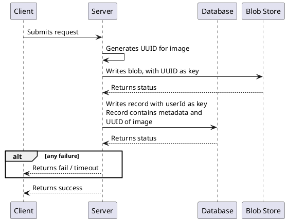
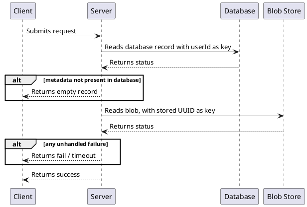

# {{page.title}}
{: .no_toc }

1. TOC
{:toc}

## Designing the working solution

The problem we faced in the last solution was that the images were overwriting each other in the blob store. To perform a write, the blob was overwritten, leaving the system in an inconsistent state that would be returned by the read. The solution to this is simple: We generate a UUID for image, store it, and then associate it with the database record. That way the database record and image change together in a transactional manner.

### Write Profile

### Read Profile

### Assumptions

We assume the UUID is always unique. This isn't strictly true. The likelihood of each UUID being non-unique is 1/(2.71 quintillion). However, for the purpose of our model, we treat the probability as 0 and move on.
> _Note: Deciding on what assumptions to make will be harder when the probability of failure is more likely. For example, a 1/(1 billon) event would happen to Facebook many times a day. It is critical to track your assumptions and back them up with observability/monitoring or other techniques._

## Modeling the working solution

The state machine is unchanged, but the state definitions will be updated.



## Verifying the solution
### Single Server

We're pretty confident this solution is going to work, but we've been confident before. We'll start our test using just a single server, **s1**.


SPECIFICATION Spec

CONSTANTS
    SERVERS = {s1}
    METADATAS = {m1, m2}
    USERIDS = {u1}
    IMAGES = {i1, i2}
    UUIDS = {ui1, ui2, ui3, ui4, ui5}

CONSTRAINT
    StopAfter3Operations

INVARIANT
    TypeOk
    ConsistentReads


We also limit our total operations (*Read* or *Write*) to 3. That might not sound like much, but it's caught all our errors so far.

But this time, instead of errors, we get back a state space:


This is all the states that were tested by the checker. And it worked! We're not done yet, though; this is just a single server. Let's see what happens when we throw a second one in the mix.

### Two Servers

We are now testing with two servers, **s1**, and **s2**. We are again stopping after 3 operations.


SPECIFICATION Spec

CONSTANTS
    SERVERS = {s1, s2}
    METADATAS = {m1, m2}
    USERIDS = {u1}
    IMAGES = {i1, i2}
    UUIDS = {ui1, ui2, ui3, ui4, ui5}

CONSTRAINT
    StopAfter3Operations


This test passes too!



Note how the number of states has expanded drastically. This is to be expected; two servers can interact in a lot more ways than one server. So the two tests that have been guiding our entire development have passed! Are we done now? Not quite.

### Final large test

Before we can be really confident, we have to run a larger test. We're going with 4 servers this time, and way more types of images and metadata. We're also going up to 10 operations. This is overall a much more representative test. Why didn't we start with it?


CONSTANTS
    SERVERS = {s1, s2, s3}
    METADATAS = {m1, m2, m3}
    USERIDS = {u1, u2, u3, u4, u5}
    IMAGES = {i1, i2, i3}
    UUIDS = {ui1, ui2}

CONSTRAINT
    StopAfter10Operations



The state space grows exponentially on the number of constants. The previous tests completed in seconds. This test completed in hours. It's easy to make a test that will take days. The recommended technique is to start small and work your way up. Finally, do a large test on a powerful machine. [The TLA+ toolbox can even spin up fast cloud workers.](https://nightly.tlapl.us/doc/cloudtlc/) If you get failures with small tests, a large test isn't going to be any better. But if all your small tests are passing, it's time to really stress test the solution. In general, running the biggest test you can afford to wait for is the right answer (unless you know particular details about your system that would make expanding the test unnecessary). 

Here is the final state space. Look how large it is:



Precise state profiling needed to be turned off just so this model would run.

### Summary

Now we can be confident in our solution. And this is how it will remain forever, perfect and untouched! I bet no one is going to want to add features. Oh wait...

  

| Next: [(Adding Requirements) A more cost efficent solution](../cost-efficent) |