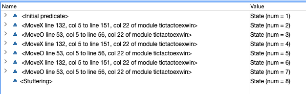



## Introduction

A [formal model](https://en.wikipedia.org/wiki/Formal_methods) is a mathematical description of a system, generally to be implemented in hardware or software. They are useful for two reasons. Firstly, mathematics, unlike English, is precise and unambiguous. Even if this is where you stop, it forces you to understand the system you are describing. Secondly, mathematically based models can be checked. You can describe success criteria, and if they are violated you can see the exact series of steps that led to that. This is particularly useful for distributed systems, from multiple threads on a computer to thousands of computers in a cloud service.

When you think about formal modeling, it's easy (and intimidating) to jump straight to the most complex use cases. Sure, those algorithm geniuses who design the fundamental algorithms of distributed systems might need it, but what about me? I care about the quality of my work. But I work in industry. Maybe I work in the cloud, coordinating microservices. Maybe I'm a game developer writing the next multiplayer networking library. Maybe I'm building a peer to peer file storage solution. Regardless, the question remains:

>How can I model the system I'm building in a way that's useful, practical, and has good ROI for myself and my company?

For every example on this site, we're going to try to take a pragmatic approach that mirrors the engineering design lifecycle.  We'll start with UML diagrams and relatively precise descriptions, and then convert them into a formal specification language. Then we'll see how we can check for design errors, and get concrete examples as to how they occur. Finally we will show how to use the detailed model errors to progressively refine your designs.

## The modeling and model testing language
TLA+ is a specification language developed by Leslie Lamport, one of the computer science greats. It has a model checker: TLC, which works in a brute force manner to check every possible state of your modelled system.

[TLA+ is used in industry](https://lamport.azurewebsites.net/tla/industrial-use.html). [AWS is one of its most enthusiastic users](https://cacm.acm.org/magazines/2015/4/184701-how-amazon-web-services-uses-formal-methods/fulltext), along with  Microsoft and Intel. 

While it looks very math-y, it is surprisingly accessible and practical. TLA+ was designed as a tool for engineers, not just algorithmists. But current examples tend to fall into one of two categories: toy problems, or complex algorithms. One of my goals with this site is to present examples that show how it can be used in an engineering process for "normal" engineers.

My advice is to skim the examples and see if they resonate. Could this help you in your day-to-day? Does it pique your interest? If so, go through the [learning material](learning-material) and revisit this post. 

However if you are mathematically inclined and obsessed with complex distributed system algorithms already, I'd advise you just jump straight to the TLA+ Video Series: [Leslie Lamport will be able to sell you better than I can](https://lamport.azurewebsites.net/video/videos.html).

## I want to run the examples without looking at the [learning material](learning-material)!
Ok, here's how: 
First download [VSCode TLA+](https://marketplace.visualstudio.com/items?itemName=alygin.vscode-tlaplus)

For each example you want to run:
1. Click _Download Code_. The file will look like "modelfoo.tla"
2. Scroll down (or hit _Next Section_), where you will see a _Download Configuration_ link. Click it. The file will look like "modelfoo.cfg"
3. Place both files in the same folder. Make sure they have the same name (other than the extension). If necessary rename "modelfoo_small.cfg" to "modelfoo.cfg"
4. Open the folder in VSCode and open the TLA file
5. Right click inside the editor and click _Check Model with TLC_
6. An output window will open and you will get a result. _Or you will get an error, probably because you didn't rename the .cfg file_

For any example that relies on additional model files, simply download them and place them in the same folder before clicking _Check Model with TLC_.

## What does modeling get us? (A Simple Example)
We will start with a toy problem, Tic-Tac-Toe, just to demonstrate some of the core benefits of modeling and model checking. This is the only toy problem, so feel free to [skip ahead to the practical part](database-blob). If you want to get a bit more of an intuitive understanding, keep reading.

### The Model

_I advise that you look at the code both in LaTex and code form. The LaTex is generated directly from the code and can let you appreciate the math a bit better._



Essentially, this model describes every game of Tic-Tac-Toe that could be played, including games where someone has already won, but the board isn't full. The model checker actually shows us how many possible board/move combinations exist:

 

It ends when there are no more spaces left to fill. None of the Next actions are activated, so the system "deadlocks". Sometimes this behavior is an error, but for us it's a feature. You can configure how to treat it.

### Checking the Model

All right, that's kind of cool, but so what? Say that it would be really bad if **O** were to win. We can check a model against the _OHasNotWon_ invariant to make sure it's impossible for **O** to win. Let's run that now.



Now the interesting thing is not that **O** can win Tic-Tac-Toe. We probably knew that. But the model checker uses Breadth-First-Search, so not only is this a possible **O** victory, there are no faster victories. What's also interesting is how clearly it is presented. The data above is EXACTLY what comes out of the model checker, prettied up with generic css and a bit of annotation. Look how much clearer it is than standard a code debugger. Because we're not debugging code, we're debugging logic.

Let's see what happens when **X** wins.



Finally, let's look at a stalemate. In those past wins, it looked like the other player wasn't trying very hard. That's because we saw the fastest possible wins. Let's see a potential stalemate:



So **O** blocked an **X** win here, but there is no intelligence yet. There is another world where **O** didn't block **X**, and it was an **X** win. This is just one of the possible stalemates. So in our current system it will be possible for **O** to win. What can we do to fix that?

### Playing not to lose

Let's imagine it is really important that **O** never win. If they do, the casino you work for loses millions of dollars (why they introduced high-stakes Tic-Tac-Toe is above our pay grade). 

**O** will still play every possible game available to it. But the casino is **X**, meaning we can change its strategy. How do we do that? We put stricter limits on what is considered an allowable move for **X**:

- The previous version of MoveX let **X** be put into any unfilled space. 
- In this updated version, a programmer read the WikiHow on "How to Play Tic-Tac-Toe" and made a best attempt at a strategy.

We need to prove the **O** will not win if this strategy is used. We do this by encoding it to TLA+ and running the same check (to see the full implementation, click _Download Code_ or _Download PDF_):



Let's see what happens when we set it up with invariant OHasNotWon:



We didn't get an error trace! Normally that's a cause for suspicion; did we mess up the test? But by building incrementally we can have more confidence: we've seen this test fail. So we did it! **O** wil never win. So what exactly does that mean?

The strategy isn't optimal (i.e. wins in the smallest number of moves) or deterministic. For any given turn it may allow multiple moves. The TLC model checker tested all of those moves and ensured that **O** would never win, no matter which of those moves we pick. This is true no matter what **O** does. We will call all moves allowed by the strategy _Strategy Moves._

If we wanted to maximize winning, we could run a machine learning algorithm that tries to predict which move would lead to victory. It doesn't even need to be completely logical, it could try to psych out its opponent, or realize that people wearing red shirts are more likely to move left. As long as it only picks moves that are _Strategy Moves_ we will never lose.
  



This is a silly example. But combining machine learning with logical safeguards designed and tested with TLA+ has a lot of potential. TLA+ is logical modeling; it can't give you statistical optimization or tell you how many 9s of reliability you will get. But it can let you update algorithms confidently, knowing that critical parameters will be met.

### Playing to win

"So you stopped us from losing," says your boss, "but that was yesterday, and anyway, we're a company of winners." "Right on it boss," you respond, because you know what to do next. To prove that our system is going to win, we have to first describe winning. Let's start with what we already know.


Won("X") is true when X has Won
[]Won("X") means always Won("X"). 

But at the start of the game you haven't won. This would fail. We need a new operator.

<>Won("X") means Won("X") must EVENTUALLY be true 


This is what's called a _Temporal Property_, a property that is measured across steps, and we can test for it. **X** eventually winning sounds exactly like what we want. 

> _If a little thing called "Eventual Consistency" is important to you, don't worry, you'll see this again!_

So let's test our code. 

>.">

We get an error, but it's unlike any we've seen before. What is a _Stuttering Step_? Well, so far we've been thinking about this one state after another. But another valid thing that can happen is nothing. And nothing can happen forever. There's a world where one of the participants just walks away from the game board, which means X will never win. How cool is it that our modeling tool can point that out to us?

But don't worry, our casino won't allow that to happen. If a player can take a move, they will eventually take a move. We say that formally with the concept of Fairness. Weak Fairness (represented as WF) roughly means that if a move can be made, and that fact doesn't change, the move will eventually be made. We define it below.



> _Note: Fairness isn't something we are checking for, it's a property of how the system works._

Great, let's run it again.



So we didn't succeed. X does not always eventually win. The house may not always win, but it never loses. We can live with that. But if you figured out an algorithm to make X always win, this is a way to prove it.
> _Tic-Tac-Toe is a solved problem, and there is no such algorithm, but don't let that limit you._

  

|Next: [Coordinating a Database and Blob Store](database-blob)|
